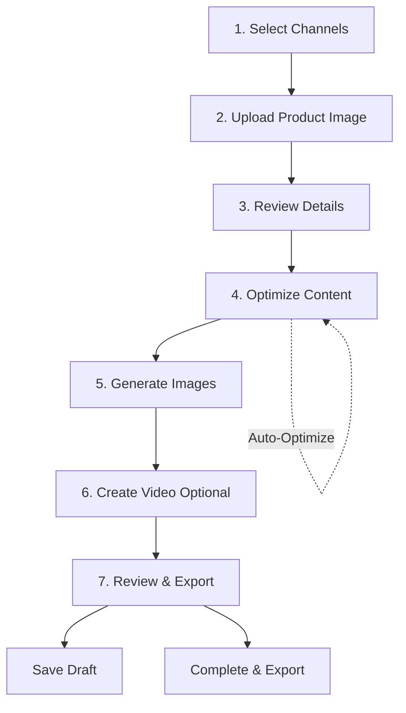

# Create Listing Page Redesign - Implementation Complete

## Overview
The "Create Listing" page has been completely redesigned to provide a more guided, visual, and intuitive multi-channel listing creation experience.

## 🎯 Key Changes

### 1. **Channel-First Approach**
- **Channel selection is now Step 1** (moved from later in the flow)
- Users choose their target platforms (Amazon, Etsy, Shopify, etc.) before anything else
- This allows the entire workflow to adapt to platform-specific requirements

### 2. **Persistent Channel Rules Display**
- After selecting channels, a **ChannelRulesSummary** component displays marketplace-specific constraints
- Shows title limits, description limits, and image requirements for each selected channel
- Remains visible throughout the entire workflow (Steps 2-7)

### 3. **Guided Onboarding System**
- **StepGuidePopup** component provides contextual help for each step
- Pop-ups can be dismissed permanently ("Got it") or temporarily ("Remind me later")
- Stored in localStorage to remember user preferences
- Each step has tailored guidance explaining what to do

### 4. **7-Step Workflow**

#### **Step 1: Select Channels**
- Choose one or more sales platforms
- Visual channel cards with color-coded borders
- Shows export format (CSV/API) and key requirements
- Enhanced success feedback when channels are selected

#### **Step 2: Upload Product Image**
- Upload 1-3 real product images
- Enter short product description (2-3 sentences)
- This data feeds the AI generation system

#### **Step 3: Review Product Details**
- Enhanced visual layout with product image preview
- Edit title, description, quantity, and SKU
- Clean form design with helper text
- Modern rounded input fields

#### **Step 4: Optimize Content**
- AI-generated titles, descriptions, and tags per channel
- **Auto-Optimize** button for instant SEO improvements
- Channel-specific content editor (BaseOverridesEditor)
- Adapts to each platform's unique requirements

#### **Step 5: Generate AI Images**
- Creates product mockups or enhanced visuals
- Supports multiple image styles per channel
- Integrates with AI image generation services

#### **Step 6: Create Video (Optional)**
- 5-10 second promotional video generation
- Skip if not needed
- AI-powered video creation

#### **Step 7: Review & Export**
- Final preview of complete listing
- Save as draft or complete
- Export data per channel format (CSV/API)

## 🎨 Visual Design Updates

### Color Palette
- **Primary gradient**: Blue to Purple (`#2196F3` → `#9C27B0`)
- **Success gradient**: Green to Blue (`#4CAF50` → `#2196F3`)
- **Channel-specific colors**:
  - Shopify: `#96BF48`
  - eBay: `#E53238`
  - Facebook/IG: `#1877F2`
  - Amazon: `#FF9900`
  - Etsy: `#F16521`
  - TikTok: `#000000`

### Design System
- **Border radius**: 8-12px (rounded-2/rounded-3)
- **Card shadows**: elevation 2-4
- **Typography**: Clean hierarchy with font weights 400/600/700
- **Spacing**: Consistent 16-24px gaps
- **Pastel backgrounds**: 5-10% opacity overlays

## 📁 New Components

### `ChannelRulesSummary.tsx`
```typescript
// Displays persistent channel rules summary
// Shows after Step 1, remains visible through Step 7
// Highlights platform-specific constraints
```

### `StepGuidePopup.tsx`
```typescript
// Guided onboarding popup system
// localStorage-based dismissal tracking
// "Got it" / "Remind me later" options
// Appears once per step for new users
```

## 🔧 Modified Components

### `ListingWizard.tsx`
- Reordered step flow (Channels → Upload → Details...)
- Added stepGuides dictionary with contextual help
- Integrated ChannelRulesSummary (shown after Step 1)
- Added StepGuidePopup for each step
- Enhanced progress tracking

### `ChannelSelector.tsx`
- Improved typography (h4 heading)
- Removed redundant warning alert
- Enhanced success feedback with gradient box
- Better visual hierarchy

### `GenericDetailsStep.tsx`
- Added product image preview card
- Enhanced form layout with dividers
- Better helper text for each field
- Improved button styling
- "Continue to Optimization" CTA

## 🔄 Workflow Logic



## 🧠 AI Integration Points

1. **Step 2 → Step 3**: Product image + description → AI extracts product details
2. **Step 3 → Step 4**: Basic info → AI generates channel-specific content
3. **Step 4**: Auto-Optimize button → SEO Brain API call
4. **Step 5**: Product image + details → AI generates mockups/visuals
5. **Step 6**: Images + details → AI generates promotional video

## 📱 Responsive Design
- Mobile-first approach
- Stacked layout on small screens
- Horizontal channel cards on tablets/desktop
- Touch-friendly tap targets
- Optimized for 320px to 1400px+ widths

## 🧪 Testing Checklist

- [ ] Channel selection persists across steps
- [ ] Channel rules summary displays correct constraints
- [ ] Step guide popups appear on first visit
- [ ] Step guide dismissal saves to localStorage
- [ ] Progress bar updates correctly (0-100%)
- [ ] Back buttons work at each step
- [ ] Save Draft functionality works
- [ ] Auto-Optimize calls SEO API correctly
- [ ] Image upload and preview work
- [ ] Video generation (optional) can be skipped
- [ ] Final review shows complete listing
- [ ] Export formats match channel requirements

## 🚀 Usage

### For Developers
```bash
# Navigate to Create Listing page
/app/create

# Components are in:
components/CreateListing/
  - ListingWizard.tsx (main)
  - ChannelSelector.tsx
  - ChannelRulesSummary.tsx (new)
  - StepGuidePopup.tsx (new)
  - GenericDetailsStep.tsx (enhanced)
  - BaseOverridesEditor.tsx
  - ImagesStep.tsx
  - VideoStep.tsx
  - ReviewStep.tsx
```

### For Users
1. Start by selecting which platforms you want to sell on
2. Upload your product photo and add a quick description
3. Review AI-generated product details
4. Let AI optimize your listing for each channel (or use Auto-Optimize)
5. Generate professional images
6. Optionally add a promotional video
7. Review everything and export!

## 🎯 Success Metrics
- **Reduced time to create listing**: Guided flow speeds up process
- **Higher completion rates**: Clear progress and helpful tips
- **Better SEO scores**: Auto-Optimize feature
- **Improved multi-channel adoption**: Channel-first approach

## 📝 Future Enhancements
- [ ] Bulk channel selection presets ("Social", "Marketplaces", "All")
- [ ] AI-suggested channels based on product type
- [ ] Real-time character count for title/description per channel
- [ ] Preview mode showing listing as it will appear on each platform
- [ ] Advanced SEO scoring with breakdown
- [ ] Template system for recurring products
- [ ] Integration with inventory management

## 🐛 Known Issues
- None currently - initial implementation complete

## 📚 Related Documentation
- [Channel API Documentation](./docs/api/channels.md)
- [SEO Brain Integration](./docs/ai/seo-brain.md)
- [Image Generation Guide](./docs/ai/image-generation.md)

---

**Last Updated**: 2025-10-17  
**Version**: 2.0.0  
**Status**: ✅ Complete
